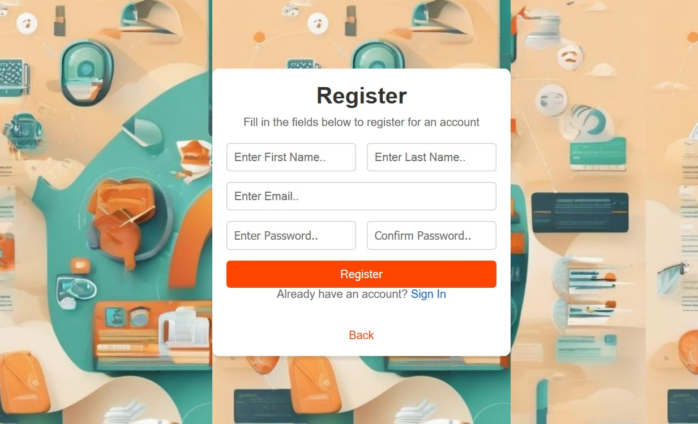
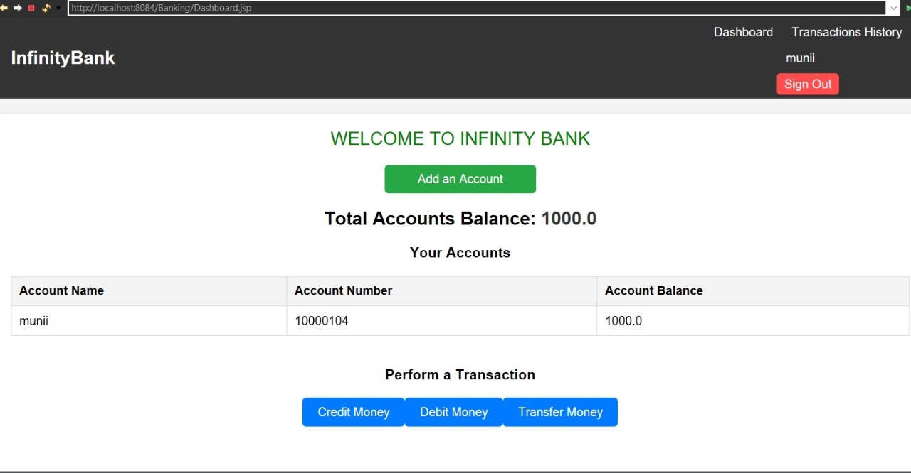
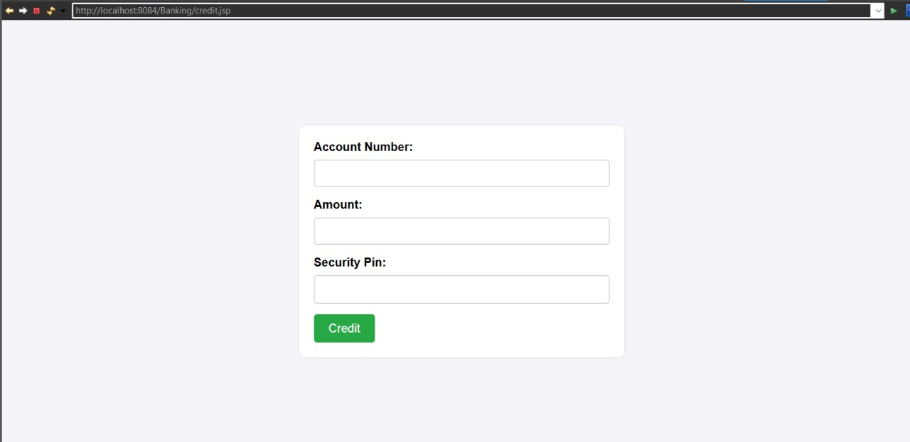

# Banking Management System

This project is a comprehensive **Banking Management System** developed using **JDBC** for backend operations and **JSP** for frontend. It includes features such as account creation, deposits, withdrawals, and fund transfers between accounts. The project aims to provide an efficient way to manage banking transactions and maintain records.

## Features
- **User Account Creation**: Create new accounts for users with initial details.
- **Deposit and Withdrawal**: Users can deposit or withdraw money from their accounts.
- **Fund Transfer**: Allows users to transfer funds between accounts.
- **Transaction History**: View transaction history for each account.
- **Admin Panel**: Manage accounts and view all transactions.

## Project Structure
The project uses **Java** for the backend, **JDBC** for database interaction, and **JSP** for the frontend interface. The system is connected to an online/cloud database for real-time data management.

## Technologies Used
- **Java** (JDK 8+)
- **JDBC** for database operations
- **JSP** for frontend
- **MySQL** (or any preferred RDBMS) as the database
- **Apache Tomcat** (or another servlet container) to run the application

## Screenshots

### 1. Login Page


### 2. User Dashboard


### 3. Account Creation


### 4. Credit Funds



> **Note:** To add these images, ensure you have a directory named `images` in the project folder, where all screenshots are stored. Replace the image file names with the actual names of your screenshots.

## Setup and Installation
1. Clone this repository:
   ```bash
   git clone https://github.com/your-username/banking-management-system.git
